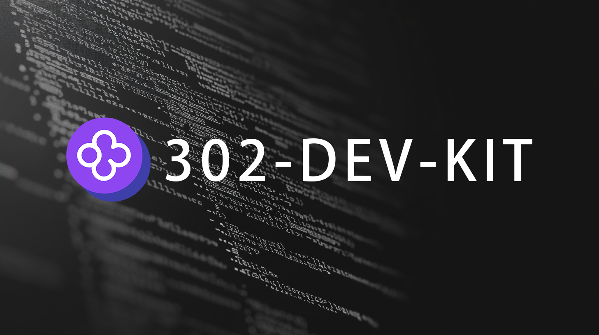

# <p align="center">🤖 302-Dev-Kit🚀✨</p>

<p align="center"><code>302-Dev-Kit</code>は、302.AIのAPIをベースにした、高速で効率的な開発体験を提供することを目的としたNext.jsベースのWebプロジェクトです。このプロジェクトには、基本的なコンポーネント、フック、ユーティリティ関数が含まれており、開発者が本番環境レベルのAIツールアプリケーションを迅速に構築するのに役立ちます。</p>

<p align="center"><a href="https://302.ai/ja/" target="blank"></a></p >

<p align="center"><a href="README_zh.md">中文</a> | <a href="README.md">English</a> | <a href="README_ja.md">日本語</a></p>



## 機能特性

- **コンポーネントベースの開発**: プロジェクト構造が明確で、コンポーネントの区分が明確です。公共コンポーネント、フォームコンポーネント、グローバルコンポーネント、基本コンポーネントが含まれています。
- **状態管理**: Zustandを使用して状態管理を行います。
- **国際化サポート**: 多言語サポート（中国語、英語、日本語）が組み込まれています。
- **豊富なユーティリティ関数**: APIリクエスト、認証、イベントディスパッチなどのユーティリティ関数が含まれています。
- **コード規約**: ESLintとPrettierを使用してコードチェックとフォーマットを行います。

## ディレクトリ構造

```plaintext
root
├── src
│   ├── app
│   ├── layout                     // ルートレイアウト
│   │── auth                       // 認証ページ
│   │   ├── index                  // エクスポートモジュール
│   │   ├── _components            // プライベートコンポーネント
│   ├── (land)                     // ランディングページグループ
│   │   │── page                   // メインランディングページ
│   │   │── _components            // プライベートコンポーネント
│   ├── components                 // 公共コンポーネント
│   │   ├── common                 // 共通コンポーネント
│   │   ├── forms                  // フォームコンポーネント
│   │   ├── global                 // グローバルコンポーネント
│   │   ├── ui                     // 基本コンポーネント
│   ├── constants                  // 定数
│   │   ├── forms                  // フォーム関連の定数
│   │   ├── menus                  // メニューオプション
│   ├── hooks                      // フック
│   │   ├── auth                   // 認証モジュールのフック
│   │   ├── global                 // グローバルフック
│   ├── icons                      // アイコン
│   │   ├── auth                   // 認証モジュールのアイコン
│   │   ├── global                 // グローバルモジュールのアイコン
│   ├── lib                        // ユーティリティ関数
│   │   ├── api                    // リクエスト関連のユーティリティ関数
│   │   ├── mitt                   // イベントディスパッチツール
│   │   ├── utils                  // その他のユーティリティセット
│   ├── services                   // リクエスト関数
│   │   ├── auth                   // 認証リクエスト
│   ├── locales                    // 国際化
│   │   ├── zh                     // 中国語
│   │   ├── en                     // 英語
│   │   ├── ja                     // 日本語
│   ├── stores                     // 状態管理
│   │   ├── slices                 // モジュール状態の分割
│   │   ├── index                  // エクスポートモジュール
│   ├── styles                     // スタイル
│   │   ├── global                 // グローバルスタイル
│   │   ├── info                   // 情報スタイル
│   ├── env.ts                     // 環境変数制御
└── package.json
```

## インストール

1. リポジトリをクローンします：

   ```bash
   git clone https://github.com/302ai/302-Dev-Kit
   ```

2. 依存関係をインストールします：

   ```bash
   cd 302-Dev-Kit
   npm install
   ```

## スクリプトコマンド

- `npm run build`: 本番環境用にビルドします。
- `npm run dev`: 開発環境を起動します。
- `npm run lint`: ESLintを実行してコードチェックを行います。
- `npm run start`: 本番環境を起動します。
- `npm run clean`: 生成されたビルドファイルをクリーンアップします。
- `npm run check`: コードフォーマットをチェックします。
- `npm run format`: コードをフォーマットします。

## 依存関係

### 本番依存関係

- `@hookform/error-message`
- `@hookform/resolvers`
- `@radix-ui/react-alert-dialog`
- `@radix-ui/react-checkbox`
- `@radix-ui/react-dialog`
- `@radix-ui/react-dropdown-menu`
- `@radix-ui/react-icons`
- `@radix-ui/react-label`
- `@radix-ui/react-slot`
- `@radix-ui/react-toast`
- `@t3-oss/env-nextjs`
- `@tanstack/react-query`
- `ahooks`
- `class-variance-authority`
- `clsx`
- `geist`
- `jiti`
- `ky`
- `ll`
- `lucide-react`
- `mitt`
- `next`
- `next-themes`
- `react`
- `react-dom`
- `react-hook-form`
- `tailwind-merge`
- `tailwindcss-animate`
- `zod`
- `zustand`

### 開発依存関係

- `@trivago/prettier-plugin-sort-imports`
- `@types/eslint`
- `@types/node`
- `@types/react`
- `@types/react-dom`
- `@typescript-eslint/eslint-plugin`
- `@typescript-eslint/parser`
- `eslint`
- `eslint-config-next`
- `eslint-config-prettier`
- `eslint-plugin-check-file`
- `eslint-plugin-n`
- `eslint-plugin-tailwindcss`
- `postcss`
- `prettier`
- `prettier-plugin-tailwindcss`
- `tailwindcss`
- `typescript`

## 開発ガイド

### 開発環境の起動

```bash
npm run dev
```

### 本番環境のビルド

```bash
npm run build
```

## コードスタイルと規約

ESLintを使用してコードチェックを行い、Prettierを使用してコードフォーマットを行います。コードを提出する前に、チェックとフォーマットを通過していることを確認してください。

```bash
npm run lint
npm run format
```

## 国際化

このプロジェクトは複数の言語をサポートしており、現在中国語、英語、日本語をサポートしています。言語ファイルは `src/locales` ディレクトリに保存されています。

## ライセンス

このプロジェクトはMITライセンスの下で提供されています。
